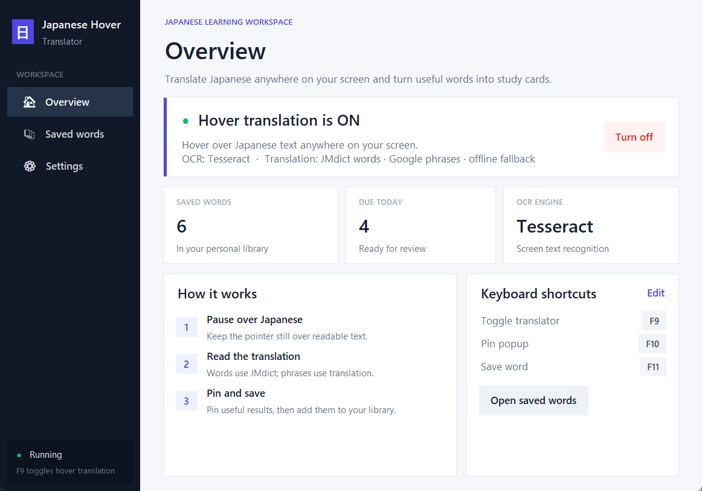
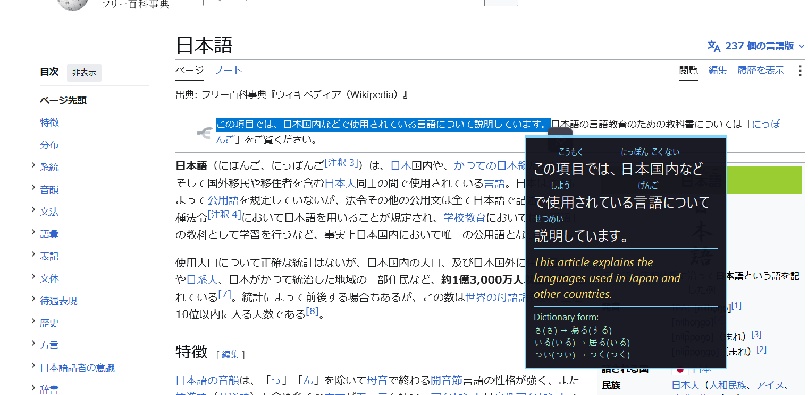
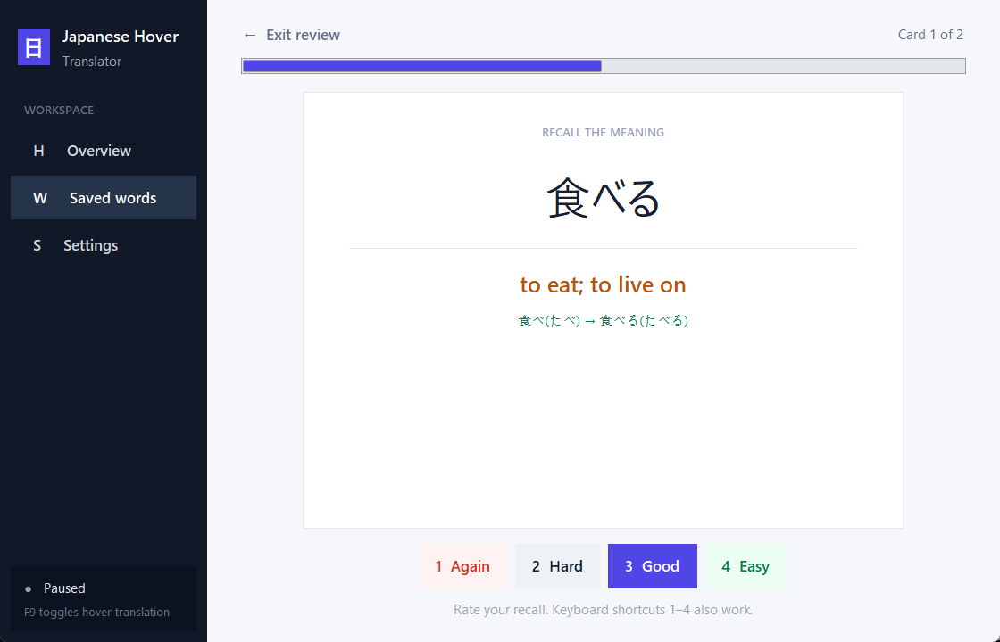
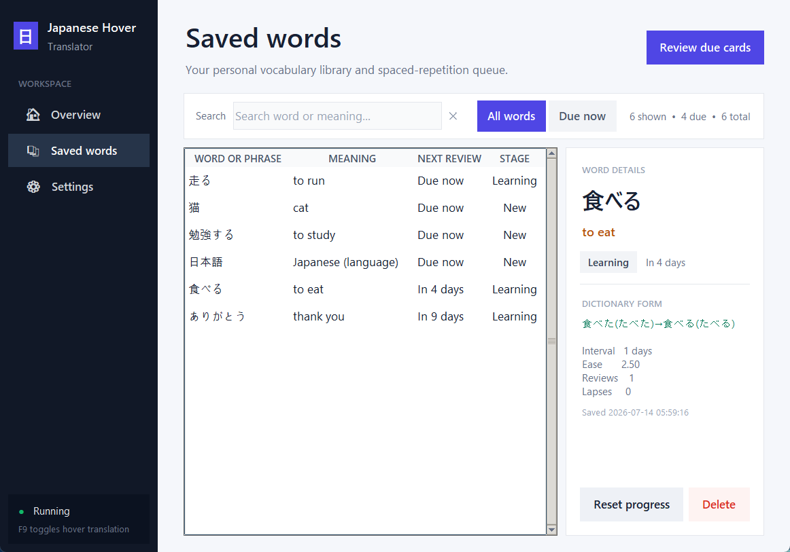

# Japanese Hover Translator

[](LICENSE)
[](#install-and-run-from-source)
[](#install-and-run-from-source)
[](#reliability-logs-and-tests)

A Windows study tool that translates Japanese text when you pause the mouse over it.
It combines cursor-anchored OCR, local JMdict word definitions, phrase translation,
furigana, dictionary-form breakdowns, pin/save hotkeys, SM-2 spaced repetition, and a
light-mode desktop dashboard — no cloud account, API key, or subscription required.





**Status:** actively developed, expect rough edges. Running from source
(`python src/dashboard_app.py`) leaves a console window open in the background, since
`python.exe` always attaches one — grab a [packaged release](../../releases) instead if
you don't want that; it opens with no console at all.

## Contents

- [What it does](#what-it-does)
- [How it works](#how-it-works)
- [Install and run from source](#install-and-run-from-source)
- [OCR setup](#ocr-setup)
- [Build the Windows bundle](#build-the-windows-bundle)
- [Reliability, logs, and tests](#reliability-logs-and-tests)
- [Default hotkeys](#default-hotkeys)
- [Spaced-repetition study](#spaced-repetition-study)
- [Data and privacy](#data-and-privacy)
- [Known limitations](#known-limitations)
- [Project layout](#project-layout)
- [Contributing](#contributing)
- [Security](#security)
- [Licenses](#licenses)

## What it does

- Hover over Japanese text in almost any Windows app to open a translation popup.
- Show real offline JMdict readings, word classes, and definitions for single words.
- Translate phrases with Google Translate, then use bundled OPUS-MT if Google is offline.
- Prefer selected text when available, avoiding OCR errors entirely.
- Reject OCR text that is not actually under the pointer, so empty-space hovers stay quiet.
- Keep cursor and capture coordinates aligned on Windows display scaling from 100% upward.
- Show furigana and dictionary forms for inflected verbs and adjectives.
- Pin the current popup, save it, and review due cards with SM-2 spaced repetition.
- Cache translations locally so repeated phrases appear immediately.
- Keep only the newest hover request, preventing old translations from appearing late.
- Remap the global toggle, pin, and save hotkeys from the Settings page.
- Navigate a clean desktop dashboard with an overview, searchable word library,
  focused review mode, and grouped settings.

No API key, cloud account, or usage fee is required. Word lookups are fully local and
normally complete in under a millisecond. Phrases use Google Translate when reachable;
results are cached locally, requests have a bounded timeout, and the bundled 80 MB INT8
OPUS-MT model keeps phrase translation working when Google is unavailable.

## How it works

Three threads, coordinated through one queue, all owned by `dashboard_app.DashboardApp`:

```
 cursor polling ──▶ dwell detected ──▶ selection read, or OCR capture
 (dwell thread)                        (Tesseract or Windows OCR)
                                                │
                                                ▼
                                   furigana + dictionary-form analysis
                                   (fugashi/UniDic)
                                                │
                          ┌─────────────────────┼─────────────────────┐
                          ▼                     ▼                     ▼
                  popup shown now      queued for translation   saved on demand
                  (Tk main thread)     (translation thread)      (SM-2 scheduler)
                                                │
                                   JMdict (single words, offline)
                                        │              │
                                   miss/phrase     Google Translate
                                        │           (cached, backoff)
                                        └──────┬───────┘
                                               ▼
                                     bundled offline OPUS-MT
                                     (guaranteed fallback)
```

Neither background thread ever touches a Tkinter widget directly — every cross-thread
event goes through `ui_queue` and is applied on the Tk main thread by
`DashboardApp._poll_queue`. See the docstrings on `DashboardApp` and `HoverTranslator`
in the source for the full picture; both classes document their threading model at the
top of the class.

## Install and run from source

Requirements:

- Windows 10 or 11
- CPython 3.9–3.14
- [Git LFS](https://git-lfs.com/) (`git lfs install`, once per machine) — the bundled
  JMdict database and translation model are tracked through it; without it, `git clone`
  silently gets small pointer files instead of the real ~130 MB of data and the app
  won't run
- A Japanese OCR backend (see the next section)
- Internet access for Google-quality phrase translations (optional; offline fallback included)

```powershell
git lfs install
git clone https://github.com/marclourens19/japanese-hover-translator.git
cd japanese-hover-translator
python -m venv .venv
.\.venv\Scripts\Activate.ps1
python -m pip install --upgrade pip
python -m pip install -r requirements.txt
python src\dashboard_app.py
```

No API key or separate dictionary/model download is required. The first dependency
install includes UniDic Lite, so it can take a little longer than the other packages.

## OCR setup

The app detects its OCR backend at startup and shows the chosen backend on the Home page.

- **Tesseract 5 with `jpn.traineddata`** is preferred when present because it performed
  better on this app's small screen captures in side-by-side testing.
- **Windows OCR with Japanese installed** is the automatic no-executable fallback.

For Tesseract, install the maintained
[Windows build](https://github.com/UB-Mannheim/tesseract/wiki). The executable may be on
`PATH`, in a standard install directory, or supplied through `TESSERACT_CMD`. Japanese
data may be in Tesseract's `tessdata` folder, this project's `tessdata` folder,
`%USERPROFILE%\.tessdata`, or a folder supplied through `TESSDATA_PREFIX`.

For Windows OCR, add Japanese under **Settings → Time & language → Language & region**
and install its language features. Restart the app afterward.

To force a backend while troubleshooting:

```powershell
$env:JAPANESE_HOVER_OCR_BACKEND = "windows"   # or "tesseract"
python src\dashboard_app.py
```

Remove the variable to return to automatic selection.

## Build the Windows bundle

The release uses PyInstaller's folder-based mode. Folder mode starts faster and is more
reliable for the bundled native OCR and translation libraries than extracting a large
single-file executable on every launch.

```powershell
.\build_release.ps1
```

Distribute the complete `dist\JapaneseHoverTranslator` folder as a ZIP. Users extract it
and run `JapaneseHoverTranslator.exe`; they do not need Python or translation packages.

JMdict is updated frequently. To satisfy its update terms and keep definitions current,
run this at least monthly before publishing a new release:

```powershell
.\scripts\update_jmdict.ps1
```

## Reliability, logs, and tests

The app writes a UTF-8 diagnostic log on every run. Logs rotate at 2 MB with three
backups, so an unattended installation cannot grow them without limit:

- Packaged app: `%LOCALAPPDATA%\JapaneseHoverTranslator\logs\JapaneseHoverTranslator.log`
- Source checkout: `logs\JapaneseHoverTranslator.log`

Unexpected hover-cycle failures are contained and retried instead of terminating the
background worker. If JMdict or the Google client becomes unavailable, translation
degrades to the bundled offline model. Startup and Tk callback failures show a readable
message with the exact log location. Configuration writes are atomic, so an interrupted
save does not replace a valid configuration with a partial file.

The regression suite uses Python's standard-library `unittest`; no test-only package is
required:

```powershell
python -m unittest discover -s tests -t . -v
```

`run_tests.cmd` runs the same command. The suite covers cursor-anchored OCR rejection,
noise/confidence filtering, hover-worker recovery, real JMdict lookup and inflection,
translation fallback and caching, atomic settings, legacy database migration, SM-2
transitions, and physical log rotation.

## Default hotkeys

| Action | Key |
|---|---|
| Turn hover translation on/off | F9 |
| Pin or unpin the popup | F10 |
| Save the pinned item | F11 |

The keys can be changed from Settings. Saving only works while the popup is pinned,
which prevents accidental saves from fleeting hover results.

## Spaced-repetition study



Open **Saved Words** and choose **Review due cards**. New cards are due immediately;
after revealing the answer, grade your recall with **Again**, **Hard**, **Good**, or
**Easy** (keyboard shortcuts 1–4). The SM-2 scheduler stores each card's interval,
ease, repetitions, review count, lapses, and next due time. Successful reviews follow
the standard 1-day, 6-day, then ease-multiplied interval sequence; an Again response
resets repetitions and schedules the card for the next day.

Existing databases migrate automatically. Cards previously marked learned retain a
six-day review interval, while other saved cards enter the due queue immediately.
The Saved Words page shows each card's stage and next review, and lets you reset an
individual schedule without deleting the word.

The Saved Words page supports instant Japanese/English search and quick **All words** / 
**Due now** filtering. Selecting an item opens a fixed detail panel with its meaning,
dictionary form, learning stage, next review, interval, ease, reviews, and lapses.



## Data and privacy

- OCR, Japanese word analysis, and single-word JMdict lookup run locally.
- Phrases that are not JMdict entries are sent to Google Translate. If Google is
  unreachable, the same phrase is translated by the bundled offline model instead.
- Google phrase results are cached locally, so repeated phrases do not make another request.
- Source runs store settings, study items, and the translation cache beside the source.
- Packaged runs use `%LOCALAPPDATA%\JapaneseHoverTranslator`, which remains writable even
  when the program itself is installed in a protected folder.
- Selection detection briefly simulates Ctrl+C, reads the clipboard, and restores its
  previous contents. Known terminal window classes are skipped so Ctrl+C is not sent as
  an interrupt.

See [SECURITY.md](SECURITY.md) for the full data-flow breakdown, including the one
inherent trust boundary (the Tesseract executable, if you use that OCR backend) and how
to report an actual security issue.

## Known limitations

- JMdict materially improves words, but names and game-specific terminology can still be
  absent or ambiguous. Phrases remain machine translation and can still be wrong.
- The free Google Translate integration is an unofficial web integration rather than the
  paid Cloud Translation API. Google can rate-limit or change it; the offline fallback
  prevents that from making the app unusable.
- OCR is imperfect, especially for tiny, stylized, low-contrast, vertical, or densely
  packed text. Selecting text first is the most reliable path when an app allows it.
- OCR now requires a recognized word box near the pointer. This stops background text
  from triggering empty-space hovers, but very small or badly positioned text may be
  rejected instead of producing a popup.
- Selection detection follows keyboard focus. If the focused window differs from the
  window under the pointer, the app will not use that selection.

## Project layout

```
japanese-hover-translator/
├── src/                          application source (see below)
├── tests/                        unittest regression suite
├── data/                         bundled JMdict database + its licenses
├── models/                       bundled offline translation model
├── docs/                         README screenshots
├── scripts/                      JMdict build/update tooling
├── japanese_hover_translator.spec   PyInstaller build definition
├── build_release.ps1             one-command Windows bundle build
├── run_tests.cmd / run_tests.ps1 one-command test runner
└── requirements*.txt
```

`src/`:

- `dashboard_app.py` — primary GUI and entry point (`python src/dashboard_app.py`)
- `hover_translate.py` — hover worker, OCR backends, overlay, configuration, and storage
- `dictionary_lookup.py` — indexed local JMdict lookup and learner-friendly formatting
- `phrase_translation.py` — cached Google phrase translation with bounded offline fallback
- `offline_translation.py` — local OPUS-MT runtime, output cleanup, and caches
- `spaced_repetition.py` — deterministic SM-2 review scheduling and date helpers
- `app_logging.py` — rotating diagnostics and uncaught-exception reporting
- `study_app.py` — legacy entry point that redirects to the primary dashboard

Every module above has a docstring explaining its role, and every non-trivial
class/method has one too — start with the class docstrings on `DashboardApp`
(in `src/dashboard_app.py`) and `HoverTranslator` (in `src/hover_translate.py`)
for the two biggest pieces.

## Contributing

Contributions are welcome — see [CONTRIBUTING.md](CONTRIBUTING.md) for how to
get set up, where things live, and the ground rules that keep the threading
model and packaged build from regressing.

## Security

This app is entirely local with no server or accounts; see
[SECURITY.md](SECURITY.md) for the full explanation of what data goes where,
and how to report an actual vulnerability.

## Licenses

The application is [MIT licensed](LICENSE). The bundled model and runtime components keep
their own licenses; see [THIRD_PARTY_NOTICES.md](THIRD_PARTY_NOTICES.md) and the license
inside the model directory.
